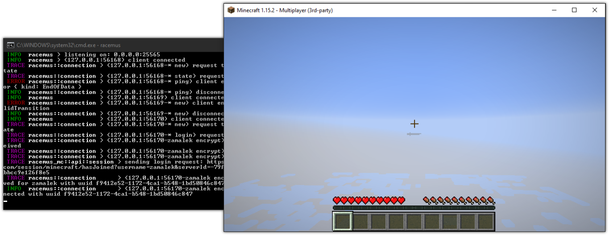

[](https://github.com/jcdickinson/racemus/actions?query=workflow%3A%22Continuous+Integration%22)
[](https://coveralls.io/github/jcdickinson/racemus?branch=master)
[](https://github.com/jcdickinson/racemus/releases/)


# Racemus

Racemus is an experimental distributed [Minecraft](https://minecraft.net) server written in [Rust](https://www.rust-lang.org/). It is currently in development and nearly nothing works.



## Installation: Windows

1. Download and install [OpenSSL](https://slproweb.com/products/Win32OpenSSL.html).
2. Download the latest release from the [project releases](https://github.com/jcdickinson/racemus/releases) and extract it to a folder.
3. Execute the following from within the folder:
```sh
openssl genrsa -out server_rsa.pem 1024
openssl rsa -in server_rsa.pem -inform PEM -outform DER -out server_rsa
openssl rsa -in server_rsa.pem -inform PEM -outform DER -pubout -out server_rsa.pub
SET RACEMUS_LOG=racemus=trace
racemus
```

## Installation: Docker

A prebuilt Linux Docker images exists. You can start it by running:

```sh
docker run -d -p 25565:25565 jcdickinson/racemus:latest
```

## Development: Windows

The windows-gnu toolchain is used for debugging, this is because the CodeLLDB extension seems to do a much better job of almost all aspects of debugging Rust sources.

1. You will need 64-bit g++ tools installed *and in your path:*
  * [Strawberry Perl](http://strawberryperl.com/): circumvents the comical MSys/MinGW package management fiasco
  * [MSys](https://www.msys2.org/): untested
2. In a shell in the project root:
  1. Run `generate-key.ps1` in the project root.
  2. Run `rustup target add x86_64-pc-windows-gnu --toolchain nightly`.
  3. Run `cargo build --target x86_64-pc-windows-gnu` as a sanity check.

## Contributing

This project isn't yet in the place where it can accept contributors.

## Copyright and License

See the [license.](./LICENSE).