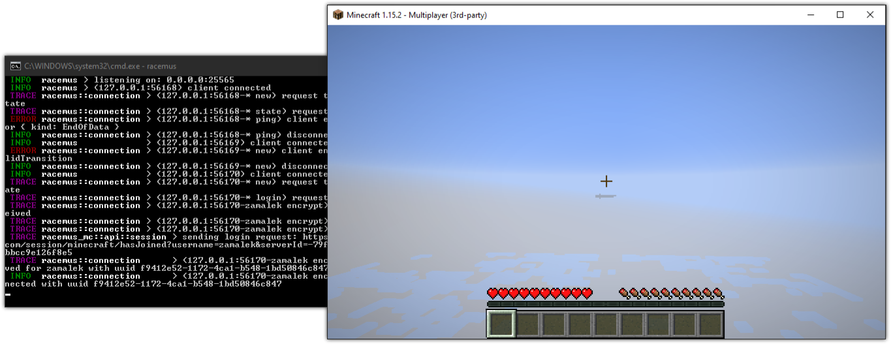

# Racemus

[](https://github.com/jcdickinson/racemus/actions?query=workflow%3A%22Continuous+Integration%22)
[](https://coveralls.io/github/jcdickinson/racemus?branch=master)
[](https://github.com/jcdickinson/racemus/releases/)

Racemus is an experimental Minecraft server.



# Getting Started

1. `generate-key.ps1` is both a Powershell and Bash script. You will need
   openssl on the path.
2. `rustup target add x86_64-pc-windows-gnu --toolchain nightly`
3. Once you have a key, cargo run should just work.

# Docker

You can run the latest build with:

```sh
docker run -p 25565:25565 jcdickinson/racemus
```